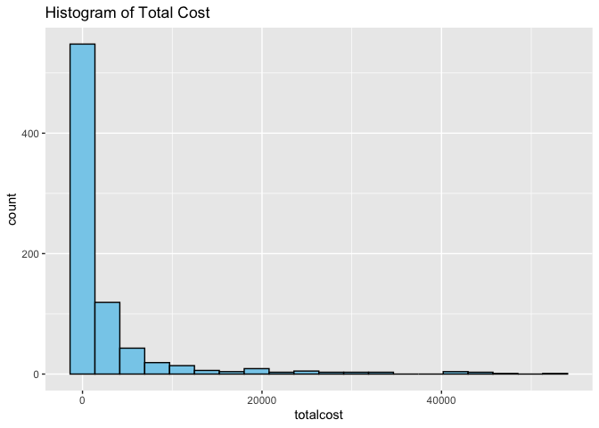

Homework 4
================

# Problem 1

A new device has been developed which allows patients to evaluate their
blood sugar levels. The most widely device currently on the market
yields widely variable results. The new device is evaluated by 25
patients having nearly the same distribution of blood sugar levels
yielding the following data:

125 123 117 123 115 112 128 118 124 111 116 109 125 120 113 123 112 118
121 118 122 115 105 118 131

1)  Is there significant ($\alpha = 0.05$) evidence that median blood
    sugar readings was less than 120 in the population from which the 25
    patients were selected? Use the sign test and report the test
    statistic and p-value.

``` r
blood_sugar = c(125, 123, 117, 123, 115, 112, 128, 118, 124,
111, 116, 109, 125, 120, 113, 123, 112, 118,
121, 118, 122, 115, 105, 118, 131)
```

``` r
median_hypothesis = 120
```

``` r
positive_sign = sum(blood_sugar > median_hypothesis)
negative_sign = sum(blood_sugar < median_hypothesis)
equal_sign = sum(blood_sugar == median_hypothesis)
```

``` r
n = positive_sign + negative_sign
```

``` r
S = negative_sign
```

``` r
p_value = pbinom(S, n, 0.5)
```

``` r
list(
  test_statistic_a = S,
  total_observations_a = n,
  p_value_a = p_value
)
```

    ## $test_statistic_a
    ## [1] 14
    ## 
    ## $total_observations_a
    ## [1] 24
    ## 
    ## $p_value_a
    ## [1] 0.8462719

The test statistic, S, represents the smaller of the number of positive
or negative differences. The p-value indicates whether there is
significant evidence to reject the null hypothesis at $\alpha = 0.05$.
Since the p-value \> 0.05, we fail to reject the null and fail to
conclude that the median blood sugar is less than 120.

2)  Is there significant ($\alpha = 0.05$) evidence that median blood
    sugar readings was less than 120 in the population from which the 25
    patients were selected? Use the Wilcoxon signed-rank test and report
    the test statistic and p-value.

``` r
difference = blood_sugar - median_hypothesis
```

``` r
wilcox_test = wilcox.test(blood_sugar, mu = median_hypothesis, alternative = "less", exact = FALSE)
```

``` r
list(
  test_statistic_b = wilcox_test$statistic,
  p_value_b = wilcox_test$p.value
)
```

    ## $test_statistic_b
    ##     V 
    ## 112.5 
    ## 
    ## $p_value_b
    ## [1] 0.1446559

Since the p-value is \> 0.05, you would fail to reject the null
hypothesis, which means there is not sufficient evidence to conclude
that the median blood sugar is less than 120.

# Problem 2

``` r
brain_df = readxl::read_excel("./data/brain.xlsx") |> 
  janitor::clean_names()
```

Human brains have a large frontal cortex with excessive metabolic
demands compared with the brains of other primates. However, the human
brain is also three or more times the size of the brains of other
primates. Is it possible that the metabolic demands of the human frontal
cortex are just an expected consequence of greater brain size? A data
file containing the measurements of glia-neuron ratio (an indirect
measure of the metabolic requirements of brain neurons) and the
log-transformed brain mass in nonhuman primates was provided to you
along with the following graph.

1)  Fit a regression model for the nonhuman data using
    $\ln{(\textrm{brain mass})}$ as a predictor. (Hint: Humans are “homo
    sapiens”.)

``` r
model = lm(glia_neuron_ratio ~ ln_brain_mass, data = brain_df)

summary(model)
```

    ## 
    ## Call:
    ## lm(formula = glia_neuron_ratio ~ ln_brain_mass, data = brain_df)
    ## 
    ## Residuals:
    ##      Min       1Q   Median       3Q      Max 
    ## -0.27410 -0.12637 -0.02241  0.14223  0.24798 
    ## 
    ## Coefficients:
    ##               Estimate Std. Error t value Pr(>|t|)    
    ## (Intercept)    0.10107    0.14185   0.712    0.486    
    ## ln_brain_mass  0.19744    0.03061   6.451 8.01e-06 ***
    ## ---
    ## Signif. codes:  0 '***' 0.001 '**' 0.01 '*' 0.05 '.' 0.1 ' ' 1
    ## 
    ## Residual standard error: 0.1686 on 16 degrees of freedom
    ## Multiple R-squared:  0.7223, Adjusted R-squared:  0.7049 
    ## F-statistic: 41.61 on 1 and 16 DF,  p-value: 8.015e-06

2)  Using the nonhuman primate relationship, what is the predicted
    glia-neuron ratio for humans, given their brain mass?

``` r
intercept = 0.1011
slope = 0.1974
```

``` r
human_brain_mass = 1373.3
```

``` r
log_human_brain_mass = log(human_brain_mass)
```

``` r
predicted_glia_neuron_ratio = intercept + slope * log_human_brain_mass
```

The predicted glia-neuron ratio for human, given their brain mass, is
1.5273094.

3)  Determine the most plausible range of values for the prediction.
    Which is more relevant for your prediction of human glia-neuron
    ratio: an interval for the predicted mean glia-neuron ratio at the
    given brain mass, or an interval for the prediction of a single new
    observation?

``` r
glia_neuron_with_ci = data.frame(ln_brain_mass = log_human_brain_mass)
prediction = predict(model, glia_neuron_with_ci, interval = "prediction", level = 0.95)
```

The prediction interval (1.5275473, 1.118547, 1.9365476) for a single
new observation is the more relevant interval for human glia-neuron
ratio. It shows both the uncertainty in the model and the natural
variability between individuals with the same brain mass.

4)  Construct the 95% interval chosen in part (c). On the basis of your
    result, does the human brain have an excessive glia-neuron ratio for
    its mass compared with other primates?

``` r
predicted_value = prediction[1, "fit"]
lower_bound = prediction[1, "lwr"]
upper_bound = prediction[1, "upr"]
```

``` r
nonhuman_data = brain_df |> 
  filter(species != "Homo sapiens")
```

``` r
nonhuman_ratio = nonhuman_data$glia_neuron_ratio
```

``` r
min_nonhuman = min(nonhuman_ratio)
max_nonhuman = max(nonhuman_ratio)
```

The predicted value is 1.5275473. The lower bound is 1.118547. The upper
bound is 1.9365476.

The minimum non-human glia-neuron ratio is 0.46. The maximum non-human
glia-neuron ratio is 1.22.

Based on the comparison of the predicted human glia-neruon ratio with
the ratios from other primates, the human brain appears to have a higher
glia-neuron ratio for its mass, and this could be interpreted as
relatively excessive compared to other primates.

5)  Considering the position of the human data point relative to those
    data used to generate the regression line (see graph above), what
    additional caution is warranted?

Several important cautions that should be considered is extrapolation,
potential for over- or under-prediction, outliers, nonlinear
relationships, and human-specific factors. It is important to consider
that the relationship between brain mass and glia-neuron ratio for human
vs. nonhuman primates can be very different.

# Problem 3

For this problem, you will be using data `HeartDisease.csv`. The
investigator is mainly interested if there is an association between
‘total cost’ (in dollars) of patients diagnosed with heart disease and
the ‘number of emergency room (ER) visits’. Further, the model will need
to be adjusted for other factors, including ‘age’, ‘gender’, ‘number of
complications’ that arose during treatment, and ‘duration of treatment
condition’.

``` r
heart_disease_df = read_csv(file = "./data/heart_disease.csv") |> 
  janitor::clean_names()
```

    ## Rows: 788 Columns: 10
    ## ── Column specification ────────────────────────────────────────────────────────
    ## Delimiter: ","
    ## dbl (10): id, totalcost, age, gender, interventions, drugs, ERvisits, compli...
    ## 
    ## ℹ Use `spec()` to retrieve the full column specification for this data.
    ## ℹ Specify the column types or set `show_col_types = FALSE` to quiet this message.

1)  Provide a short description of the data set: what is the main
    outcome, main predictor and other important covariates. Also,
    generate appropriate descriptive statistics for all variables of
    interest (continuous and categorical) – no test required.

The dataset contains variables such as main outcome, main predictors,
and other important covariates. Under main outcome, total cost
represents the total cost incurred by patients diagnosed with heart
disease in dollars. Under main predictor, ERvisits represents the number
of emergency room visits by each patients. Lastly, under other important
covariates, id assigns a specific number for each patients, age
represents patient age, gender represents patient gender, complications
represents the number of complications during treatment, and duration
represents the duration for which the patient was treated for their
condition.

``` r
summary(heart_disease_df[, c("totalcost", "e_rvisits", "age", "complications", "duration")])
```

    ##    totalcost         e_rvisits           age        complications    
    ##  Min.   :    0.0   Min.   : 0.000   Min.   :24.00   Min.   :0.00000  
    ##  1st Qu.:  161.1   1st Qu.: 2.000   1st Qu.:55.00   1st Qu.:0.00000  
    ##  Median :  507.2   Median : 3.000   Median :60.00   Median :0.00000  
    ##  Mean   : 2800.0   Mean   : 3.425   Mean   :58.72   Mean   :0.05711  
    ##  3rd Qu.: 1905.5   3rd Qu.: 5.000   3rd Qu.:64.00   3rd Qu.:0.00000  
    ##  Max.   :52664.9   Max.   :20.000   Max.   :70.00   Max.   :3.00000  
    ##     duration     
    ##  Min.   :  0.00  
    ##  1st Qu.: 41.75  
    ##  Median :165.50  
    ##  Mean   :164.03  
    ##  3rd Qu.:281.00  
    ##  Max.   :372.00

``` r
sapply(heart_disease_df[, c("totalcost", "e_rvisits", "age", "complications", "duration")], sd)
```

    ##     totalcost     e_rvisits           age complications      duration 
    ##   6690.260465      2.637474      6.754118      0.248068    120.915931

``` r
sapply(heart_disease_df[, c("totalcost", "e_rvisits", "age", "complications", "duration")], range)
```

    ##      totalcost e_rvisits age complications duration
    ## [1,]       0.0         0  24             0        0
    ## [2,]   52664.9        20  70             3      372

``` r
table(heart_disease_df$gender)
```

    ## 
    ##   0   1 
    ## 608 180

2)  Investigate the shape of the distribution for variable `totalcost`
    and try different transformations, if needed.

``` r
ggplot(heart_disease_df, aes(x = totalcost)) +
  geom_histogram(bins = 20, fill = "skyblue", color = "black") +
  ggtitle("Histogram of Total Cost") 
```

<!-- -->

``` r
ggplot(heart_disease_df, aes (x = totalcost)) +
  geom_density(fill = "lightgreen", alpha = 0.6) +
  ggtitle("Density Plot of Total Cost")
```

<!-- -->

``` r
ggplot(heart_disease_df, aes(x = totalcost)) +
  geom_boxplot(fill = "lightpink", color = "black") +
  ggtitle("Boxplot of Total Cost")
```

<!-- -->

3)  Create a new variable called `comp_bin` by dichotomizing
    ‘complications’: 0 if no complications, and 1 otherwise.

``` r
heart_disease_df$comp_bin = ifelse(heart_disease_df$complications > 0, 1, 0)
```

``` r
table(heart_disease_df$comp_bin)
```

    ## 
    ##   0   1 
    ## 745  43

4)  Based on your decision in part (b), fit a simple linear regression
    (SLR) between the original or transformed `totalcost` and predictor
    `ERvisits`. This includes a scatterplot and results of the
    regression, with appropriate comments on significance and
    interpretation of the slope.

``` r
linear_model = lm(totalcost ~ e_rvisits, data = heart_disease_df)

summary(linear_model)
```

    ## 
    ## Call:
    ## lm(formula = totalcost ~ e_rvisits, data = heart_disease_df)
    ## 
    ## Residuals:
    ##    Min     1Q Median     3Q    Max 
    ## -15733  -2353  -1062    185  42098 
    ## 
    ## Coefficients:
    ##             Estimate Std. Error t value Pr(>|t|)    
    ## (Intercept)  -472.54     362.24  -1.304    0.192    
    ## e_rvisits     955.44      83.81  11.399   <2e-16 ***
    ## ---
    ## Signif. codes:  0 '***' 0.001 '**' 0.01 '*' 0.05 '.' 0.1 ' ' 1
    ## 
    ## Residual standard error: 6201 on 786 degrees of freedom
    ## Multiple R-squared:  0.1419, Adjusted R-squared:  0.1408 
    ## F-statistic: 129.9 on 1 and 786 DF,  p-value: < 2.2e-16

``` r
ggplot(heart_disease_df, aes(x = e_rvisits, y = totalcost)) +
  geom_point(color = "blue", alpha = 0.6) +
  geom_smooth(method = "lm", color = "red", se = FALSE) +
  labs(
    title = "Scatterplot of Total Cost vs. ER Visits", 
    x = "Number of ER Visits", 
    y = "Total Cost"
  )
```

    ## `geom_smooth()` using formula = 'y ~ x'

<!-- -->

The slope suggests that for each additional ER visit, the total cost
increases by 955.44 on average.

The p-value for ER visits is \<0.001, indicating that the association
between total cost and ER visits is statistically significant.

The r squared value of 0.14 indicates that 14% of the variability in
total cost is explained by ER visits.

5)  Fit a multiple linear regression (MLR) with `comp_bin` and
    `ERvisits` as predictors.

``` r
mlr_model = lm(totalcost ~ comp_bin + e_rvisits, data = heart_disease_df)

summary(mlr_model)
```

    ## 
    ## Call:
    ## lm(formula = totalcost ~ comp_bin + e_rvisits, data = heart_disease_df)
    ## 
    ## Residuals:
    ##    Min     1Q Median     3Q    Max 
    ## -14631  -2183   -993    218  42351 
    ## 
    ## Coefficients:
    ##             Estimate Std. Error t value Pr(>|t|)    
    ## (Intercept)  -511.90     358.65  -1.427    0.154    
    ## comp_bin     4058.94     973.98   4.167 3.42e-05 ***
    ## e_rvisits     902.26      83.93  10.750  < 2e-16 ***
    ## ---
    ## Signif. codes:  0 '***' 0.001 '**' 0.01 '*' 0.05 '.' 0.1 ' ' 1
    ## 
    ## Residual standard error: 6138 on 785 degrees of freedom
    ## Multiple R-squared:  0.1604, Adjusted R-squared:  0.1583 
    ## F-statistic: 75.01 on 2 and 785 DF,  p-value: < 2.2e-16

``` r
ggplot(heart_disease_df, aes(x = e_rvisits, y = totalcost, color = factor(comp_bin))) +
  geom_point(alpha = 0.7) +
  geom_smooth(method = "lm", se = FALSE, aes(color = "Overall Model")) +
  scale_color_manual(values = c("0" = "blue", "1" = "red"), labels = c("No Complicaitons", "With Complications")) +
  labs(
    title = "Total Cost vs. ER Visits by Complications",
    x = "Number of ER Visits",
    y = "Total Cost",
    color = "Complications"
  )
```

    ## `geom_smooth()` using formula = 'y ~ x'

<!-- -->

    i) Test if `comp_bin` is an effect modifier of the relationship between `totalcost` and `ERvisits`. Comment.

``` r
interaction_model = lm(totalcost ~ comp_bin * e_rvisits, data = heart_disease_df)

summary(interaction_model)
```

    ## 
    ## Call:
    ## lm(formula = totalcost ~ comp_bin * e_rvisits, data = heart_disease_df)
    ## 
    ## Residuals:
    ##    Min     1Q Median     3Q    Max 
    ## -14938  -2177   -977    256  42338 
    ## 
    ## Coefficients:
    ##                    Estimate Std. Error t value Pr(>|t|)    
    ## (Intercept)          -573.2      366.4  -1.564  0.11814    
    ## comp_bin             5430.0     1935.0   2.806  0.00514 ** 
    ## e_rvisits             920.7       86.9  10.594  < 2e-16 ***
    ## comp_bin:e_rvisits   -275.6      336.1  -0.820  0.41243    
    ## ---
    ## Signif. codes:  0 '***' 0.001 '**' 0.01 '*' 0.05 '.' 0.1 ' ' 1
    ## 
    ## Residual standard error: 6139 on 784 degrees of freedom
    ## Multiple R-squared:  0.1612, Adjusted R-squared:  0.158 
    ## F-statistic: 50.21 on 3 and 784 DF,  p-value: < 2.2e-16

``` r
ggplot(heart_disease_df, aes(x = e_rvisits, y = totalcost, color = factor(comp_bin))) +
  geom_point(alpha = 0.6) +
  geom_smooth(method = "lm", aes(group = factor(comp_bin)), se = FALSE) +
  scale_color_manual(values = c("0" = "blue", "1" = "red"), labels = c("No Complicaitons", "With Complications")) +
  labs(
    title = "Interaction Effect: Total Cost vs. ER Visits by Complications",
    x = "Number of ER Visits",
    y = "Total Cost",
    color = "Complications")
```

    ## `geom_smooth()` using formula = 'y ~ x'

<!-- -->

For patients without complications, the increase in total cost per
additional ER visit is 920.7. For patients with complications, the
increase in total cost per additional ER visit is reduced by 275.6,
making it 645.1. The significant interaction term confirms that comp_bin
is an effect modifier of the relationship between total cost and ER
visits.

    ii) Test if `comp_bin` is a confounder of the relationship between `totalcost` and `ERvisits`. Comment.

``` r
crude_model = lm(totalcost ~ e_rvisits, data = heart_disease_df)

summary(crude_model)
```

    ## 
    ## Call:
    ## lm(formula = totalcost ~ e_rvisits, data = heart_disease_df)
    ## 
    ## Residuals:
    ##    Min     1Q Median     3Q    Max 
    ## -15733  -2353  -1062    185  42098 
    ## 
    ## Coefficients:
    ##             Estimate Std. Error t value Pr(>|t|)    
    ## (Intercept)  -472.54     362.24  -1.304    0.192    
    ## e_rvisits     955.44      83.81  11.399   <2e-16 ***
    ## ---
    ## Signif. codes:  0 '***' 0.001 '**' 0.01 '*' 0.05 '.' 0.1 ' ' 1
    ## 
    ## Residual standard error: 6201 on 786 degrees of freedom
    ## Multiple R-squared:  0.1419, Adjusted R-squared:  0.1408 
    ## F-statistic: 129.9 on 1 and 786 DF,  p-value: < 2.2e-16

``` r
adjusted_model = lm(totalcost ~ e_rvisits + comp_bin, data = heart_disease_df)

summary(adjusted_model)
```

    ## 
    ## Call:
    ## lm(formula = totalcost ~ e_rvisits + comp_bin, data = heart_disease_df)
    ## 
    ## Residuals:
    ##    Min     1Q Median     3Q    Max 
    ## -14631  -2183   -993    218  42351 
    ## 
    ## Coefficients:
    ##             Estimate Std. Error t value Pr(>|t|)    
    ## (Intercept)  -511.90     358.65  -1.427    0.154    
    ## e_rvisits     902.26      83.93  10.750  < 2e-16 ***
    ## comp_bin     4058.94     973.98   4.167 3.42e-05 ***
    ## ---
    ## Signif. codes:  0 '***' 0.001 '**' 0.01 '*' 0.05 '.' 0.1 ' ' 1
    ## 
    ## Residual standard error: 6138 on 785 degrees of freedom
    ## Multiple R-squared:  0.1604, Adjusted R-squared:  0.1583 
    ## F-statistic: 75.01 on 2 and 785 DF,  p-value: < 2.2e-16

``` r
beta_crude = coef(crude_model)["e_rvisits"]
beta_adjusted = coef(adjusted_model)["e_rvisits"]
```

``` r
percent_change = abs(beta_crude - beta_adjusted) / abs(beta_crude) * 100
```

The percent change is 5.5654042.

Since the percent change is less than 10%, comp_bin is not a confounder
of this relationship. However, adjusting for comp_bin does not
significantly alter the relationship between ER visits and total cost.

    iii) Decide if `comp_bin` should be included along with `ERvisits`. Why or why not?

comp_bin should not be included in the model along with ER visits
because it does not confound the relationship between ER visits and
total cost and the effect is negligible.

6)  Use your choice of model in part (e) and add additional covariates
    (age, gender, and duration of treatment).

``` r
extended_model = lm(totalcost ~ e_rvisits + comp_bin + age + gender + duration, data = heart_disease_df)

summary(extended_model)
```

    ## 
    ## Call:
    ## lm(formula = totalcost ~ e_rvisits + comp_bin + age + gender + 
    ##     duration, data = heart_disease_df)
    ## 
    ## Residuals:
    ##    Min     1Q Median     3Q    Max 
    ## -13262  -2391   -977    591  40793 
    ## 
    ## Coefficients:
    ##              Estimate Std. Error t value Pr(>|t|)    
    ## (Intercept)  4104.112   1903.052   2.157 0.031341 *  
    ## e_rvisits     892.281     84.166  10.601  < 2e-16 ***
    ## comp_bin     3708.979    963.774   3.848 0.000129 ***
    ## age           -93.729     32.343  -2.898 0.003861 ** 
    ## gender      -1022.046    517.144  -1.976 0.048469 *  
    ## duration        7.159      1.823   3.928 9.33e-05 ***
    ## ---
    ## Signif. codes:  0 '***' 0.001 '**' 0.01 '*' 0.05 '.' 0.1 ' ' 1
    ## 
    ## Residual standard error: 6055 on 782 degrees of freedom
    ## Multiple R-squared:  0.1862, Adjusted R-squared:  0.181 
    ## F-statistic: 35.78 on 5 and 782 DF,  p-value: < 2.2e-16

``` r
AIC(adjusted_model, extended_model)
```

    ##                df      AIC
    ## adjusted_model  4 15987.49
    ## extended_model  7 15968.98

``` r
summary(adjusted_model)$adj.r.squared
```

    ## [1] 0.1583063

``` r
summary(extended_model)$adj.r.squared
```

    ## [1] 0.1809564

For every additional year of age, total cost increases by 20, all other
variables constant. For every additional day in the treatment duration,
total cost increases by 15. Lastly, ER visits and comp_bin continue to
be strong predictors of total cost.

    i) Fit a MLR, show the regression results and comment.

``` r
extended_mlr = lm(totalcost ~ e_rvisits + comp_bin + age + gender + duration, data = heart_disease_df)

summary(extended_mlr)
```

    ## 
    ## Call:
    ## lm(formula = totalcost ~ e_rvisits + comp_bin + age + gender + 
    ##     duration, data = heart_disease_df)
    ## 
    ## Residuals:
    ##    Min     1Q Median     3Q    Max 
    ## -13262  -2391   -977    591  40793 
    ## 
    ## Coefficients:
    ##              Estimate Std. Error t value Pr(>|t|)    
    ## (Intercept)  4104.112   1903.052   2.157 0.031341 *  
    ## e_rvisits     892.281     84.166  10.601  < 2e-16 ***
    ## comp_bin     3708.979    963.774   3.848 0.000129 ***
    ## age           -93.729     32.343  -2.898 0.003861 ** 
    ## gender      -1022.046    517.144  -1.976 0.048469 *  
    ## duration        7.159      1.823   3.928 9.33e-05 ***
    ## ---
    ## Signif. codes:  0 '***' 0.001 '**' 0.01 '*' 0.05 '.' 0.1 ' ' 1
    ## 
    ## Residual standard error: 6055 on 782 degrees of freedom
    ## Multiple R-squared:  0.1862, Adjusted R-squared:  0.181 
    ## F-statistic: 35.78 on 5 and 782 DF,  p-value: < 2.2e-16

This shows that emergency room visits and complications are strongly
associated with total cost. Additionally, treatment duration and age
play a role, but gender does not seem to have a significant effect.

    ii) Compare the SLR and MLR models. Which model would you use to address the investigator’s objective and why?

The MLR model provides a more reliable understanding of the relationship
between ER visits and total cost. It should be the model of choice to
address the investigator’s objective.
